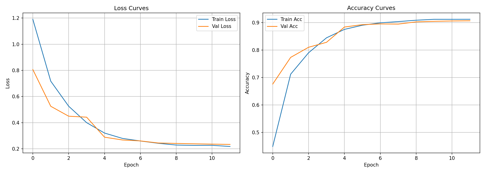
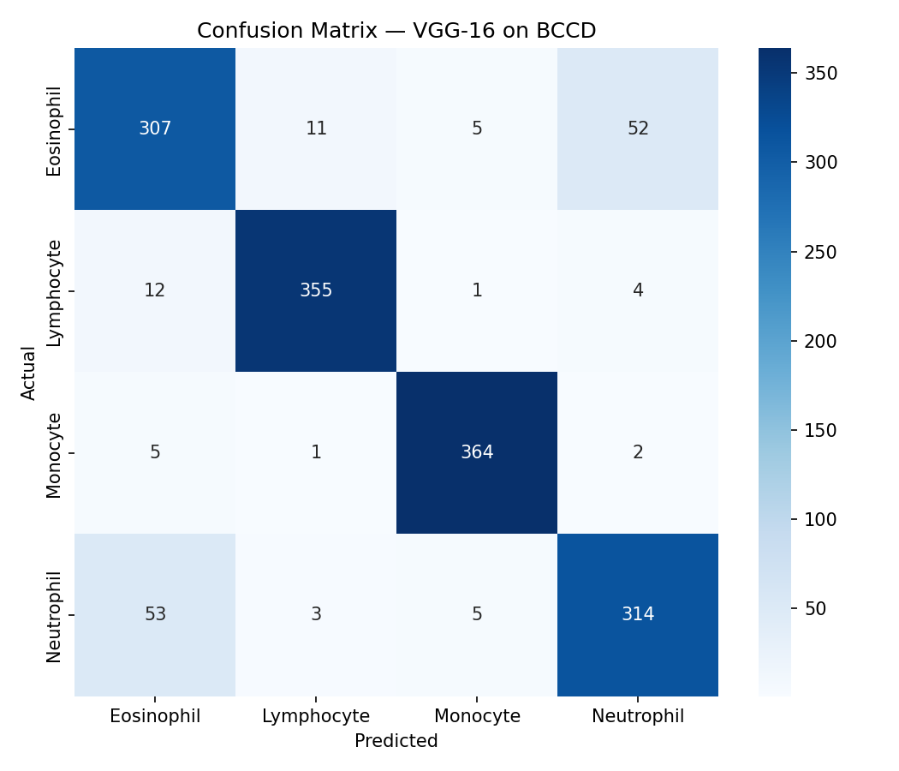
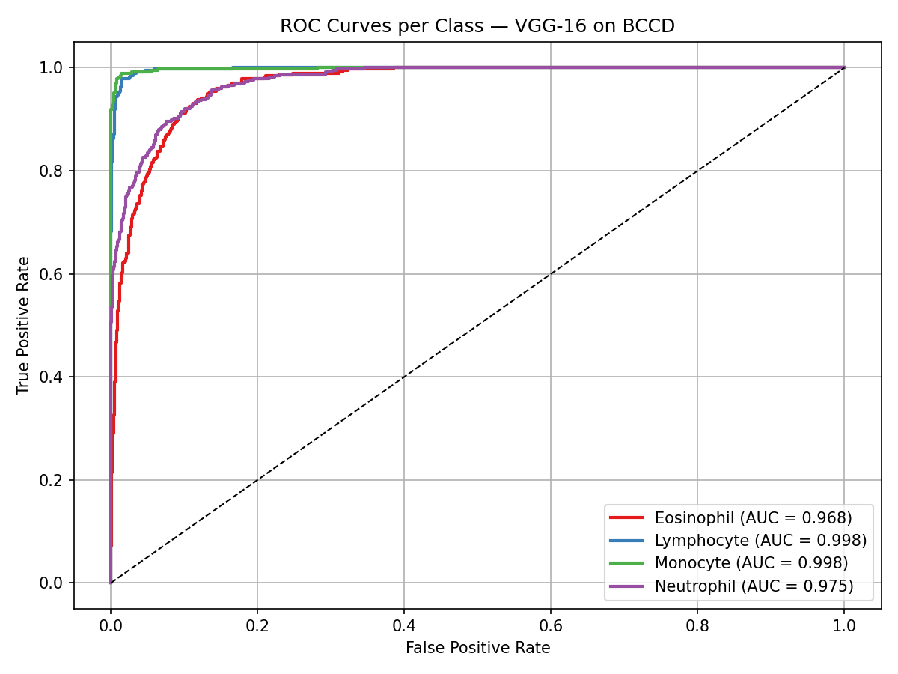

# 🩸 Blood Cell Classification using VGGNet-16

> Deep Learning Assignment — B.Tech CSE, Shri Mata Vaishno Devi University  
> Transfer learning approach for automated peripheral blood cell classification on the BCCD dataset.

---

## 👥 Team

| Name | Enrollment |
|------|------------|
| Dev Vardhan Bhamu | 23BCS025 |
| Kavya Arora | 23BCS041 |

**Course:** Deep Learning (6th Semester)

---

## 📋 Overview

This project implements **VGGNet-16** with ImageNet transfer learning to classify four types of white blood cells from microscopic peripheral blood smear images. The model achieves **89.7% test accuracy** and a **macro-average AUC-ROC of 0.985** on the BCCD dataset.

| Metric | Score |
|--------|-------|
| Accuracy | **89.7%** |
| Weighted Precision | **0.897** |
| Weighted Recall | **0.897** |
| Weighted F1-Score | **0.897** |
| Macro AUC-ROC | **0.985** |

---

## 🗂️ Dataset

**BCCD (Blood Cell Count and Detection)**  
~12,500 RGB microscopic images across 4 classes:

| Class | Train | Val | Test |
|-------|-------|-----|------|
| Eosinophil | ~2,182 | ~468 | ~467 |
| Lymphocyte | ~2,174 | ~466 | ~465 |
| Monocyte | ~2,174 | ~466 | ~465 |
| Neutrophil | ~2,220 | ~476 | ~475 |

📥 Download: [Kaggle — Blood Cell Images](https://www.kaggle.com/paultimothymooney/blood-cells)

Place the downloaded dataset at `dataset/BCCD_Dataset/` so the structure matches:
```
dataset/
└── BCCD_Dataset/
    ├── Eosinophil/
    ├── Lymphocyte/
    ├── Monocyte/
    └── Neutrophil/
```

---

## 🏗️ Model Architecture

**VGGNet-16** (Simonyan & Zisserman, ICLR 2015) with a custom classification head:

```
Conv Block 1  →  64 filters  × 2  →  MaxPool  →  112×112
Conv Block 2  →  128 filters × 2  →  MaxPool  →  56×56
Conv Block 3  →  256 filters × 3  →  MaxPool  →  28×28
Conv Block 4  →  512 filters × 3  →  MaxPool  →  14×14
Conv Block 5  →  512 filters × 3  →  MaxPool  →  7×7
FC-4096  →  ReLU  →  Dropout(0.5)
FC-4096  →  ReLU  →  Dropout(0.5)
FC-4  (Softmax)
```

**Transfer learning strategy:** Convolutional layers frozen (ImageNet weights); only the FC head is trained.

---

## ⚙️ Setup

### Using uv (recommended — already configured)

```bash
uv sync
uv run train.py
```

### Standard pip

```bash
pip install torch torchvision scikit-learn matplotlib seaborn pillow
python train.py
```

Tested with: Python 3.12 · PyTorch 2.10.0 · torchvision 0.15 · scikit-learn 1.4

---

## 🔬 Training Details

| Parameter | Value |
|-----------|-------|
| Optimizer | Adam |
| Learning Rate | 1×10⁻⁴ |
| LR Schedule | StepLR (γ=0.1, step=10) |
| Batch Size | 32 |
| Epochs | 30 |
| Loss | CrossEntropyLoss |
| Input Size | 224×224 |
| Data Split | 70% / 15% / 15% (stratified) |

**Augmentation (train only):** Random H/V flip · Rotation ±15° · Color jitter (brightness, contrast, saturation ±0.2)

---

## 📊 Results

### Per-Class Metrics (Test Set)

| Class | Precision | Recall | F1-Score | AUC-ROC | Support |
|-------|-----------|--------|----------|---------|---------|
| Eosinophil | 0.814 | 0.819 | 0.816 | 0.968 | 375 |
| Lymphocyte | 0.959 | 0.954 | 0.957 | 0.998 | 372 |
| Monocyte | 0.971 | 0.978 | 0.975 | 0.998 | 372 |
| Neutrophil | 0.844 | 0.837 | 0.841 | 0.975 | 375 |
| **Weighted Avg** | **0.897** | **0.897** | **0.897** | **0.985** | 1494 |

### Training Curves


### Confusion Matrix


> **Key observation:** The dominant error mode is bidirectional Eosinophil↔Neutrophil confusion (52 and 53 misclassifications respectively) — a known challenge in automated hematology due to overlapping nuclear morphology and staining variability.

### ROC Curves


---

## 📁 Repository Structure

```
Blood-Cell-Classification-VGG16/
├── dataset/
│   └── BCCD_Dataset/               # Download from Kaggle (not tracked by git)
│       ├── Eosinophil/
│       ├── Lymphocyte/
│       ├── Monocyte/
│       └── Neutrophil/
├── models/
│   └── vgg16_bccd.pth              # Trained model weights
├── paper/
│   └── VGG16_BCCD_IEEE_Paper_Final.docx
├── plots/
│   ├── confusion_matrix.png
│   ├── loss_accuracy_curves.png
│   └── roc_curves.png
├── train.py                        # Main training script
├── pyproject.toml
├── uv.lock
├── .gitignore
└── README.md
```

---

## 📄 Deliverables

- [x] PyTorch implementation with stratified 70/15/15 split
- [x] Trained model weights (`models/vgg16_bccd.pth`)
- [x] Evaluation: Accuracy, Precision, Recall, F1, AUC-ROC, Confusion Matrix
- [x] IEEE/Springer format paper (`paper/VGG16_BCCD_IEEE_Paper_Final.docx`)

---

## 📚 Key References

1. Simonyan & Zisserman — *Very Deep Convolutional Networks for Large-Scale Image Recognition*, ICLR 2015
2. Mooney — *BCCD Dataset*, Kaggle 2018
3. Acevedo et al. — *A dataset of microscopic peripheral blood cell images*, Data in Brief 2020

---

## 📜 License

Academic use only. Submitted as coursework for Deep Learning, B.Tech CSE (6th Sem), SMVDU.
